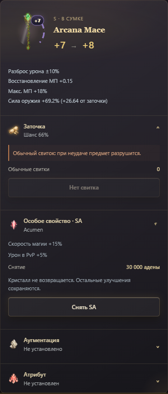
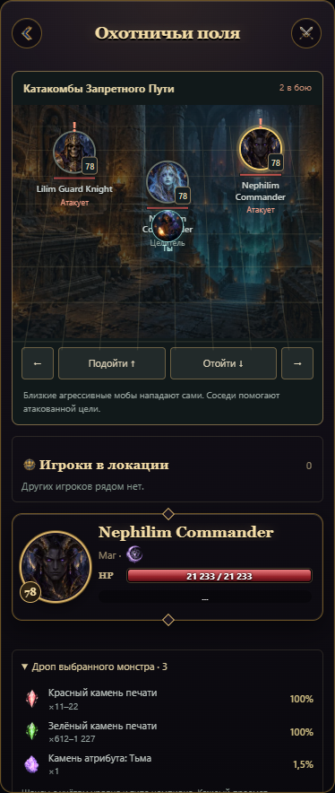

# Охота: поле боя и исправление кузницы

## Кузница

Вместо списка длинных кнопок — отдельные раскрывающиеся секции: заточка, SA, аугментация, атрибут. Изображение оружия, текущая и следующая заточка стоят в компактном заголовке. Стоимость, запас материалов, эффект и риск показаны отдельно от действия. Установленное SA показывает реальные бонусы. Подтверждение расходования ресурсов сохранено.

## Поле боя

Вход в охотничью локацию создаёт три живых цели на иллюстрированном поле. Выбор цели сам по себе не вызывает агрессию. Приближение к агрессивному мобу и атака провоцируют бой. Кнопками можно двигаться вперёд, назад и в стороны; противники преследуют персонажа и атакуют с дистанции своего типа. Оглушённые мобы не двигаются и пропускают ход.

- Воин усиливает атаку и сражается вблизи.
- Целитель восстанавливает 12% максимального HP раненому живому союзнику, с перезарядкой 16 секунд.
- Маг атакует с расстояния и ослабляет атаки персонажа на 15% на 8 секунд.
- Бафф атаки мобов даёт +15% на 12 секунд; его повторное применение имеет откат.
- Атака цели привлекает соседних мобов. Молчание мешает лечению, баффам и другим специальным действиям; маг не может атаковать под молчанием.
- Дебаффы классовых навыков и SA работают на выбранной цели: оглушение, снижение защиты/урона, замедление, молчание, периодический урон — в зависимости от имеющихся навыков и SA.
- Существующие навыки лечения, щита, баффов, банки и заряды остаются доступными.

Это адаптированная модель боя для текущего приложения. Состав NPC, уровни и таблицы дропа взяты из импортированных данных High Five; роли и поведение трёх участников встречи заданы нашей логикой и не являются точной копией AI каждого NPC L2. Это небольшое поле со сменой цели, а не открытый многопользовательский мир.

## Дроп

Добыча доступна до боя в списке монстров локации и в раскрывающемся разделе выбранной цели. Показаны название, изображение материала, количество и действительная вероятность с учётом уровня персонажа, рейта дропа и чемпиона. Атрибутные камни также включены, когда персонаж соответствует условиям получения. Каждый элемент таблицы разыгрывается отдельно; проценты не обязаны в сумме давать 100%.

Убитая цель удаляется с поля. Награды выдаются один раз, в том числе при смерти от периодического урона. Выбранная цель автоматически меняется на выжившую. Бой, позиции, HP, эффекты и активный кристалл сохраняются в сессии; изменение цели не сбрасывает повреждения и противников. Отступление убирает встречу без награды за живых мобов.

Ходы рассчитываются сервером при действиях и обновлении состояния; клиент запрашивает состояние каждые две секунды. Длительное бездействие завершает встречу через две минуты; количество догоняющих ударов ограничено. Постоянного офлайн-фарма нет.

## Проверки

`test/hunt-field.test.js` проверяет агрессию, сохранение и восстановление, помощь соседей, лечение/молчание, баффы/ослабление/оглушение, награды и вероятности дропа. `scripts/ui/check-soul-crystals.mjs` проверяет настоящие компоненты и игровые функции при 320, 390 и 1100 px, включая движение, выбор цели и раскрытие дропа. Сессии тестовые; рабочая база и опубликованный сервер не изменялись.
