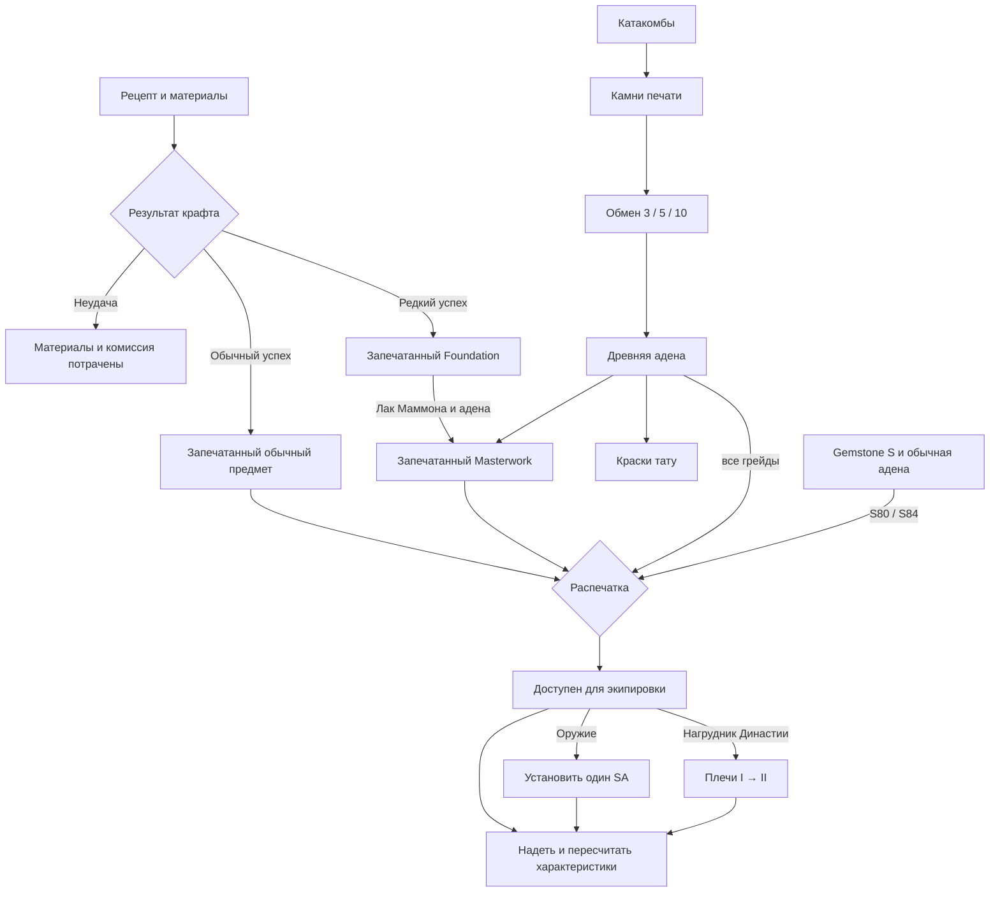

# SA, Masterwork, распечатка и катакомбы — WhitesLove

В интерактивный прототип добавлены семь окон: **SA, Masterwork, крафт, распечатка, катакомбы, обмен на AA и плечи Династии**. После добавления [плащей и эпиков](l2-cloaks-epics-design.md) всего 17 окон. Новый цикл использует общий инвентарь предметов, материалы, адену и AA; изменения видны при переходах между окнами и в состоянии героя.

[Открыть прототип](l2-windows-preview.html) в браузере; при уже открытой странице обновить её. Исходные модули находятся в `webapp/design`; сборка переносимого HTML — `node scripts/build-l2-design-preview.mjs`.

**Это продолжение дизайна и демонстрационной модели**, а не внедрение экономики в работающий игровой сервер. Численные цены, рецепты, бонусы, вероятность Masterwork и награды походов — предложенный баланс для просмотра взаимодействий. Игровые API, сохранённые персонажи, действующий крафт и боевые формулы в этом этапе не изменены.

## Основа L2 и адаптация

Историческая основа SA: способность выбирается для конкретного оружия и требует подходящий кристалл души; установка сохраняет заточку. В старых описаниях L2 предусмотрены установка и снятие у кузнецов. [Архив описания Special Abilities](https://legacy-lineage2.com/Knowledge/enhancements_3.html).

Историческая основа Masterwork: Foundation требуется обработать у Маммона, после чего появляется предмет с дополнительным эффектом. [Архив типов предметов Gracia](https://legacy-lineage2.com/Knowledge/items_overview.html). Услуги Ишумы для старших грейдов с оплатой обычной аденой и распечатка S84 описаны в [Gracia Final: Items](https://www.legacy-lineage2.com/news/graciafinal_08.html).

Катакомбы и некрополи — источник камней печати; в описании Seven Signs синие, зелёные и красные камни имеют вес 3/5/10, а AA используется у жрецов и Маммона. [Архив Seven Signs](https://legacy-lineage2.com/news/chronicle3_02.html). В WhitesLove предлагается постоянно доступный обмен по этим значениям, без ожидания двухнедельного цикла и победы стороны.

Не смешиваем историческую модель с современной Aden/Essence, где устройство Soul Crystals и событийные курсы могут отличаться. Каталог грейдов и развитие классов при подключении должны соответствовать существующему проекту.

## Общий цикл предмета

Качество, печать, заточка, SA, аугментация, атрибут и плечи — независимые свойства предмета. Распечатка не уничтожает Masterwork, обработка Foundation не снимает печать, установка SA не обнуляет заточку. Любая обработка сохраняет ID экземпляра.

## SA — кристалл души

Окно показывает доступное оружие, установленную способность, три допустимых варианта, нужный цвет и ступень кристалла, материалы и комиссию. На оружии одновременно один SA. Это отдельное улучшение, которое совместимо с заточкой, качеством Masterwork и системой аугментации ЛС.

В примере используется Посох Тайн / Arcana Mace, S, +6:

| Вариант | Кристалл в примере | Демонстрационный эффект |
| --- | --- | --- |
| Acumen / Проницательность | Красный, ступень 13 | Скорость магии +15% |
| Mana Up / Мана | Синий, ступень 13 | Максимум MP +30% |
| MP Regeneration / Восстановление | Зелёный, ступень 13 | Восстановление MP +1 |

Установка: один совместимый кристалл + 12 Gemstone S + 90 000 адены. Это адаптированная цена, а не копия стоимости исторического предмета L2. Снятие: 30 000 адены, кристалл не возвращается. Нельзя ставить второй SA, пока не снят первый. Нельзя обрабатывать надетое оружие, Foundation или предмет под печатью.

Цвет, ступень, список SA и цена должны задаваться **конкретным рецептом улучшения**, а не одним числом на весь грейд. Источники и прокачка кристаллов для сервера: выдача начального кристалла через цепочку магистра, зарядка на подходящих монстрах и рейдах; шанс и максимальная ступень — отдельные правила добычи. Текущий прототип демонстрирует установку/снятие и проверку запасов, не симулирует эту дополнительную цепочку квестов.

## Masterwork и запечатанный крафт

В кузнице доступны шесть рецептов брони и бижутерии A/S/S80/S84. Все успешные результаты этих рецептов появляются запечатанными. Оружие в примере SA уже распечатано; правило запечатанного крафта здесь не навязывается всем типам оружия L2.

- У рецепта свои материалы, комиссия и вероятность успеха: в примере 60%, у кольца — 100%.
- При успешном крафте отдельная проверка определяет редкий Foundation. В примере показано 5% **среди успешных крафтов**, а не 5% от всех попыток.
- Неудача расходует материалы и комиссию, но не создаёт вещь. Для рецепта 100% неудачный исход отключён.
- Foundation нельзя надеть; сначала нужна обработка в Masterwork.
- Обработка использует лак Маммона и обычную адену. Для A/S: 4 лака + 120 000 адены, S80: 7 лаков + 120 000, S84: 12 лаков + 240 000. Все значения демонстрационные.
- Бонус Masterwork определяется конкретным предметом и показывается отдельно от базовых статов, заточки и SA. В примере это плоская прибавка к магической атаке, магической защите или скорости магии.
- Обработанный запечатанный Masterwork затем проходит обычную распечатку своего грейда. Повторно получить бонус обработкой уже готового предмета нельзя.

Кнопки «Обычный / Foundation / Неудача · пример» позволяют проверить все ветви. При серверном внедрении исход выбирается на сервере, клиент не передаёт желаемый результат. Для реального каталога нужно отдельно утвердить исключения Masterwork-нагрудников и правила совместимости с обычными частями комплектов: они различались между обновлениями L2. В прототипе разрешён Foundation каждого из показанных рецептов как явно выбранная адаптация.

## Распечатка

| Грейд | Окно услуги | Цена демонстрационного предмета |
| --- | --- | --- |
| A | Кузнец Маммон | 12 000 AA |
| S | Кузнец Маммон | 25 000 AA |
| S80 | Маэстро Ишума | 60 000 AA + 8 Gemstone S + 180 000 адены |
| S84 | Маэстро Ишума | 120 000 AA + 16 Gemstone S + 360 000 адены |
| Плащ S80 / S84 | Маэстро Ишума | 40 000 / 80 000 AA + 100 000 / 200 000 адены |

Древняя адена (AA) списывается при распечатке **любого** предмета; обычная адена и Gemstone S — дополнительно у S80+. Masterwork тоже требует AA (S: 15 000, S80: 30 000, S84: 60 000) вместе с обычной аденой и лаком Маммона. Краски тату оплачиваются AA (нанесение 6 000, снятие 3 000).Это схема оплаты, адаптированная по запросу пользователя. **Gemstone S** — отдельный высокоуровневый материал, не валюта «Кристаллы» из шапки, не камень печати, не кристалл души и не камень атрибута. Для конкретных комплектов/частей в рабочем каталоге задаются собственные количества и цены.

В примере запечатанное снаряжение нельзя надевать; после снятия печати становится доступна экипировка. Foundation сначала обрабатывается. Если вещь уже распечатана, кнопка отключена и повторное действие не расходует материалы. Качество Masterwork, ID, заточка и остальные свойства сохраняются.

## Катакомбы и обмен на AA

Три похода: Отступники 50+, Ведьмы 65+, Запретный Путь 78+. У персонажа в примере уровень 84, 12 единиц энергии и HP. Это ограничение и награды для демонстрации; недельное расписание Seven Signs не добавлено.

| Поход | Энергия | Урон за демонстрационный бой | Синие | Зелёные | Красные |
| --- | --- | --- | --- | --- | --- |
| Отступники | 1 | 80 | 180 | 90 | 30 |
| Ведьмы | 2 | 140 | 300 | 140 | 60 |
| Запретный Путь | 3 | 220 | 450 | 220 | 100 |

Кнопка победы показывает выдачу наград. Камни сразу попадают в общий запас; HP и энергия уменьшаются. Поход блокируется при недостаточном уровне, энергии или HP. Это не новый работающий режим боя и не автоматический фарм.

Обмен: `AA = синие × 3 + зелёные × 5 + красные × 10`. Можно выбрать количества каждого цвета или все запасы. Поля принимают только целые неотрицательные значения не больше остатка; пустой обмен блокируется. Перед подтверждением виден итог и новый баланс AA. После обмена списываются именно выбранные камни; обычная адена остаётся без изменений.

Пример полного цикла: победа у Ведьм выдаёт 300/140/60 камней → обмен приносит 2 200 AA → древняя адена используется для распечатки A/S. Для S80/S84 копятся отдельные Gemstone S и обычная адена.

## Плечи Династии

Плечи являются **специализацией нагрудника Династии**, а не новым независимым слотом персонажа. В показанном магическом варианте доступны «Чародей» и «Целитель»; несовместимая специализация блокируется с объяснением.

| Ступень | Материал и комиссия в примере | Чародей | Целитель |
| --- | --- | --- | --- |
| I | 1 эссенция Династии I + 80 000 адены | М. атака +8%, скорость магии +5% | MP +8%, сила лечения +5% |
| II | 1 эссенция Династии II + 160 000 адены | М. атака +12%, скорость магии +7,5% | MP +12%, сила лечения +7,5% |

II заменяет I, а не складывается с ней. Для II сначала должны быть плечи I той же специализации. Нельзя применять плечи к другой части сета, постороннему комплекту, надетому нагруднику, Foundation или запечатанной вещи. ID, качество и заточка сохраняются.

Бонус плеч включается только при надетом полном комплекте Династии: нагрудник, шлем, перчатки и сапоги. Снятие любой части отключает бонус, но не удаляет установленные плечи. В макете шлем и сапоги уже надеты; перчатки сначала нужно обработать и распечатать. Полный комплект поддерживает обычные и Masterwork части согласно правилам адаптации.

В реальном каталоге дополнить специализации тяжёлой и лёгкой брони для танков, воинов, лучников и разбойников. Для каждого профиля указать семейство класса, тип брони, бонусы I/II и материалы. Не выдавать бонусы чужой специализации после смены класса.

## Раздельные характеристики

Окно состояния теперь показывает **12 отдельных параметров**:

| Параметр | Значение для интерфейса / боя |
| --- | --- |
| P. Atk | Физическая атака |
| M. Atk | Магическая атака |
| P. Def | Физическая защита |
| M. Def | Магическая защита |
| Attack Speed | Скорость физических атак |
| Casting Speed | Скорость магии |
| Accuracy / Evasion | Точность и уклонение |
| Physical Crit / Magical Crit | Раздельный шанс физического и магического крита, в процентах в этом макете |
| Move Speed | Скорость бега |
| MP Regeneration | Восстановление MP |

HP/MP/CP и шесть базовых характеристик сохранены. В демонстрационном расчёте учитываются только надетые распечатанные вещи, базовые статы конкретной вещи, заточка, бонус Masterwork, SA и плечи. Тату отдельно влияют на физическую/магическую атаку, магическую защиту, скорость магии, максимальные HP/MP, точность и крит. Процентные бонусы одного параметра складываются в общий модификатор, плоские прибавки применяются перед ним. Это формулы адаптации, а не заявление о точном повторении всех формул L2.

Эффекты Masterwork остаются отдельными бонусами, а повышение качества не заменяет P. Atk на M. Atk. SA Acumen повышает скорость магии, а не скорость физической атаки. Плечи Чародея меняют магическую атаку, а не физическую. Запечатанные и Foundation предметы не дают надетых бонусов.

## Подключение к рабочей игре

Текущий каталог `functions/game/equipment/catalog.js` уже хранит `lineage.pAtk/mAtk/pDef/mDef`. Боевые геттеры и `miniapp/character.js` используют общие `attack/defence`. Нельзя заменить эти значения подписью «магическая/физическая» без изменения правил боя и проверки баланса.

Для внедрения потребуется:

1. Версионированное состояние экземпляра: `uid`, `catalogId`, `sealed`, `quality`, `enchant`, `saId`, `augmentation`, `attribute`, `dynastyProfile`, `dynastyTier`. Качество Masterwork не должно выводиться из визуальной сохранности предмета.
2. Материалы в отдельном словаре: камни печати по цветам, Gemstone S, лак Маммона, эссенции I/II и кристаллы души по цвету/ступени. AA — отдельный баланс, обычная адена — существующее золото; новая копия обычной валюты не создаётся.
3. Серверные рецепты крафта и улучшений, цены по конкретной части предмета, ограничения класса/грейда и таблицы добычи.
4. Полный пересчёт P. Atk/M. Atk/P. Def/M. Def от класса, экипировки, комплектов, заточки, SA, Masterwork, плеч, тату, ЛС, баффов и клановых бонусов. Двуручные предметы учитывать один раз по UID.
5. Раздельный тип урона в навыках и боях: физический использует P. Atk/P. Def, магический — M. Atk/M. Def; отдельно проверить крит, скорость, лечение и регенерацию. Старые персонажи получают совместимые значения через миграцию, а не нулевые новые поля.
6. Крафт/добыча выбирают исход на сервере. Списание материалов и валюты, выдача или изменение вещи происходят атомарно; повтор запроса защищён ключом операции. Любая заблокированная операция сохраняет состояние без частичных списаний.
7. Катакомбы подключаются к существующей системе охоты и её боевым проверкам. Обмен и распечатка получают те же проверки актуального инвентаря. Для новых материалов отдельно определяются добыча, торговля, ограничения и экономика.

## Проверка прототипа

Модель проверяет полный цикл Foundation → Masterwork → распечатка, отдельные способы оплаты A/S и S80/S84, совместимость SA, сохранение заточки, условия плеч, обмен камней, ограничение походов и раздельный расчёт характеристик. Проверены отказы без изменения состояния и замена предметов в одном слоте без двойных бонусов.

Браузерная проверка проходит все 17 окон на 320, 390 и 1100 px, затем выполняет связанный цикл добычи, обмена, крафта, обработки, распечатки, экипировки плаща и улучшения эпиков. Скриншоты новых окон: `l2-design-sa-390.png`, `l2-design-masterwork-390.png`, `l2-design-craft-390.png`, `l2-design-unseal-390.png`, `l2-design-catacombs-390.png`, `l2-design-aa-390.png`, `l2-design-shoulders-390.png`, `l2-design-cloaks-390.png`, `l2-design-epics-390.png`.

Иллюстрации берутся из существующего набора: для некоторых S/S84 вещей временно используется изображение соответствующей категории S80. Финальные уникальные изображения не нужны для проверки механики и могут быть заменены отдельно.
